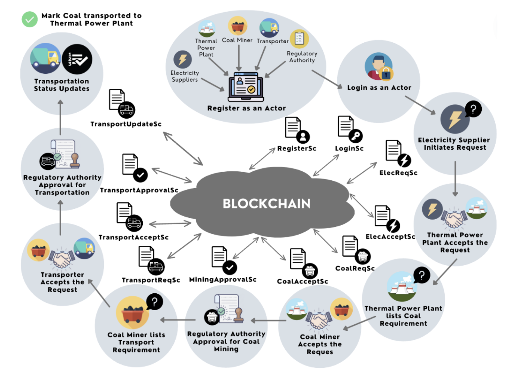
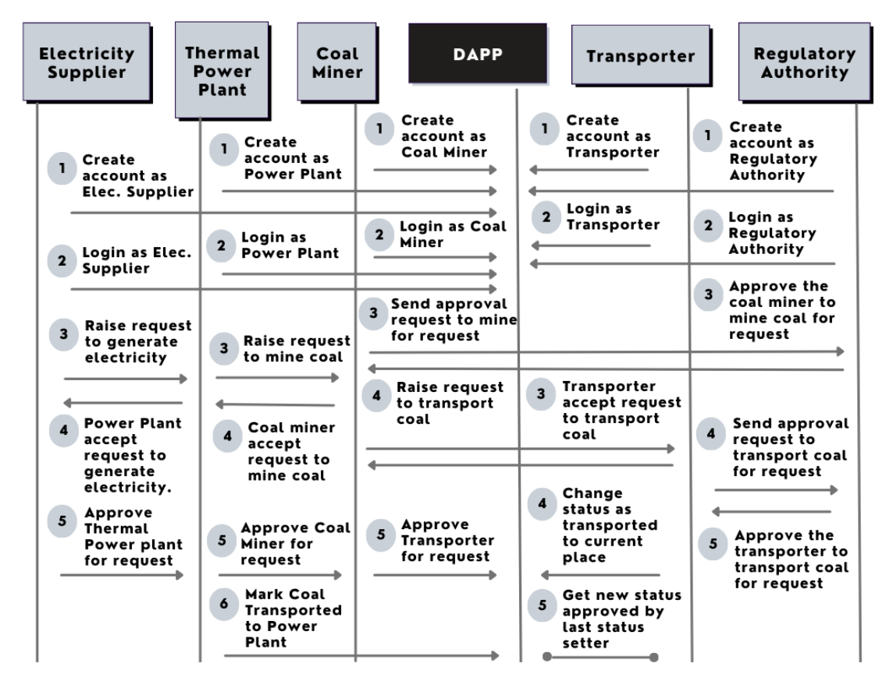
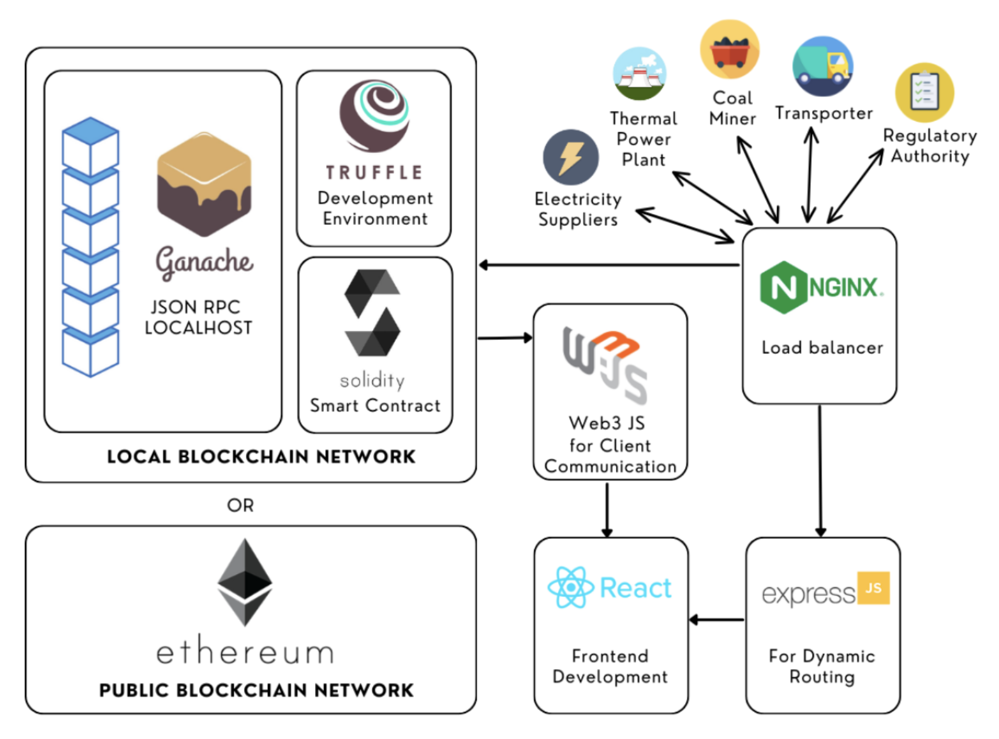
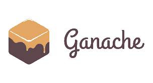
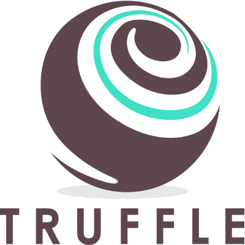

<div align="center">
  <a href="https://github.com/kailash360/TrackMine">
    
  </a>

  <h1 align="center">TrackMine</h1>
  <h3 align="center">Blockchain based Coal Supply-Chain Management System for Thermal Power Plants
  </h3>
</div>

<p align="center">
  <a href="#description">Description</a> •
  <a href="#problem">Problem</a> •
  <a href="#solution">Solution</a> •
  <a href="#key-features">Key Features</a> •
  <a href="#implementation-flow">Implementation Flow</a> •
  <a href="#contract-diagrams">Contract Diagrams</a> •
  <a href="#installation-and-setup">Installation and Setup</a>
</p>

## Description

TrackMine is an innovative blockchain-powered coal supply chain management system designed to revolutionize the coal supply chain by leveraging the robust and immutable nature of blockchain technology. Our application aims to address the inefficiencies and lack of transparency in the traditional coal supply chain by providing a secure, transparent, and efficient platform for managing all aspects of coal procurement and transportation.

## Problem

The existing coal supply chain in India faces significant inefficiencies that lead to operational slowdowns. Key issues include:

- **Transparency Issues**: The lack of real-time access to crucial information on coal origin, quality, and transportation status impedes swift decision-making.
- **Paper-Based Documentation**: Reliance on paper-based documentation introduces errors and delays, contributing to operational bottlenecks.
- **Coordination Challenges**: Coordination among coal suppliers, transporters, and power plants is inefficient, resulting in time-consuming transactions and potential miscommunications.
- **Data Security Concerns**: The absence of a transparent transaction record extends dispute resolution processes, making them cautious and time-consuming.
- **Limited Coal Traceability**: Manual compliance monitoring and reliance on intermediaries lead to oversight, delays, and inconsistencies.

## Solution

Our project addresses these challenges by implementing a blockchain-based solution that provides:

- **Decentralized Transaction Processing**: Secure and decentralized coal-supply-chain transactions, adaptable to broader blockchain applications for supply chain management.
- **Enhanced Visibility**: Transparency and traceability across the entire coal supply chain.
- **Operational Efficiency**: Streamlined processes through automated smart contracts, reducing manual intervention and operational costs.
- **Real-Time Monitoring**: End-to-end visibility for better decision-making and risk management.
- **Risk Reduction**: Minimization of risks associated with fraud, data manipulation, and operational inefficiencies.

## Key Features

- **Actor Registration and Authorization**: Secure registration and authorization process for all key actors in the coal supply chain.
- **Electricity Supplier Requests**: Mechanism for electricity suppliers to submit open requests for electricity generation to thermal power plants.
- **Thermal Power Plant Operations**: System for thermal power plants to list and manage coal requirements and accept electricity generation requests.
- **Coal Miner Operations**: Interface for coal miners to accept mining requests and list transportation requirements.
- **Transporter Operations**: Platform for transporters to accept transportation requests and provide real-time status updates.
- **Regulatory Authority Approvals**: Automated approval process for regulatory authorities to approve coal mining and transportation requests.
- **Real-Time Status Updates**: Comprehensive tracking of transportation status with updates at each breakpoint.

## Implementation Flow

1. **Register as an Actor**:
   Actors such as electricity suppliers, thermal power plants, coal miners, and transporters register on the platform through a secure process, providing necessary credentials and gaining authorization to interact with the blockchain.

2. **Login as an Actor**:
   Registered actors can log in to the platform using their credentials to access their respective dashboards and manage their activities.

3. **Electricity Supplier Initiates Request**:
   An electricity supplier submits a request for electricity generation, specifying details like the amount of electricity required, the city/area, and the state.

4. **Thermal Power Plant Accepts Request**:
   Thermal power plants review the requests from electricity suppliers, checking their capacity and operational status. Upon acceptance, they proceed to list their coal requirements.

5. **Thermal Power Plant Lists Coal Requirement**:
   The thermal power plant lists the quantity and quality of coal needed, along with the payment allocated for mining, on the blockchain.

6. **Coal Miner Accepts Request**:
   Coal miners review the listed requirements from thermal power plants. Upon acceptance, they start the coal mining process after getting the necessary regulatory approvals.

7. **Regulatory Authority Approval for Coal Mining**:
   Regulatory authorities approve the requests for coal mining, ensuring all actors meet the required criteria and compliance standards.

8. **Coal Miner Lists Transport Requirement**:
   After mining, coal miners list transportation requirements, specifying the quantity of coal, mode of transport, and payment allotted for transport.

9. **Transporter Accepts Request**:
   Transporters review the transportation requirements and accept the requests. They start the transportation of coal after getting the necessary regulatory approvals.

10. **Regulatory Authority Approval for Transportation**:
    Regulatory authorities approve the requests for transportation, ensuring all actors meet the required criteria and compliance standards.

11. **Transportation Status Updates**:
    Throughout the transportation process, the transporter updates the current location and status, providing real-time visibility of the coal's journey from the mining site to the thermal power plant.

<p align="centre">  
      
</p>

## Contract Diagrams

### Sequence Diagram

The sequence diagram below will help in understanding the flow even better.

<p align="centre">
  <a>
    
  </a>
</p>

### Architecture

The smart contracts are written with Solidity which is then compiled, migrated and deployed using Truffle.js on the local blockchain network created using Ganache-cli.The frontend uses Web3.js to communicate with the smart contract and local blockchain network and is written using React.js framework for better component and state lifecycle management.The requests from user are forwarded to frontend through Nginx(load balancer) and Express.js for dynamic routing.

<p align="centre">  
      
</p>

## Technologies Used

<h1>
  <a href="https://github.com/trufflesuite/ganache-cli">
    
  </a>
  <a href="https://soliditylang.org/">
           
  </a>
  <a href="https://reactjs.org/"></a>
  <a href="https://www.trufflesuite.com/">
    
  </a>
  <a href="https://www.npmjs.com/package/web3">
    
  </a>
  <a href="https://www.nginx.com/">
    
  </a> 
  <a href="https://expressjs.com/"></a>
  
</h1>

## Installation and Setup

Prerequisites : `npm, git, docker(optional)`

Clone the repository

```Bash
git clone https://github.com/ShwetKhatri2001/Blockchain-Coal-Supply-Chain.git && cd Blockchain-Coal-Supply-Chain
```

Install dependencies

```Bash
npm i
```

Install ganache-cli

```Bash
npm i -g ganache-cli
```

Configure ganache-cli for 10 accounts and extend gasLimit to 6721975000 and beyond, so as to have enough gas for migrating the smart contracts and a data flow for the prototype.

```Bash
ganache-cli --accounts 10 --gasLimit 6721975000
```

If you want to run the ganache-cli on docker then use the following command

```Bash
sudo docker run -d -p 8545:8545 trufflesuite/ganache-cli:latest -h 0.0.0.0 --accounts 10 --gasLimit 6721975000
```

Compile the contracts

```Bash
truffle compile
```

Migrate the contracts

```Bash
truffle migrate --network=develop --reset
```

Install all packages in the package.json file

```Bash
npm i
```

Open a second terminal and enter the client folder

```Bash
cd src
```

Run the app

```Bash
node app.js
```

The app gets hosted by default at port 3000. So open http://localhost:3000 in browser.

## License

This project uses an [MIT](https://opensource.org/licenses/MIT) license.

## Documentation to help with Solidity

https://docs.soliditylang.org/en/v0.8.4/

## Documentation to help with React

https://reactjs.org/docs/getting-started.html

## Documentation to help with Truffle

https://www.trufflesuite.com/docs/truffle/reference/configuration

## Documentation to help with Ganache-cli

https://www.trufflesuite.com/docs/ganache/overview
